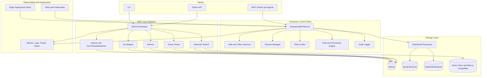

<h1 align="center"></h1><br>

[](https://pypi.org/project/siof/)
[](https://pypi.org/project/siof/)
[](https://opensource.org/licenses/MIT)
[](https://github.com/Keerthivasan-Venkitajalam/SIOF)
[](https://github.com/psf/black)
[](https://github.com/Keerthivasan-Venkitajalam/SIOF)

SIOF (Semantic Integrity and Orchestration Framework) is the fundamental toolkit for AI-native Python development.

- **Source code:** https://github.com/Keerthivasan-Venkitajalam/SIOF
- **Bug reports:** https://github.com/Keerthivasan-Venkitajalam/SIOF/issues
- **PyPI:** https://pypi.org/project/siof/

It provides:

- **Data Transformation Graph (DTG) indexing** - Map your codebase as data lineage, not control flow
- **AI slop detection** - Deterministic pattern matching for machine-generated anti-patterns
- **MCP graph server** - Expose your codebase to LLM agents via Model Context Protocol
- **Developer intent extraction (Memex)** - Preserve architectural reasoning across AI-generated mutations
- **Sustainability tracking (Green Guard)** - Monitor energy consumption and enforce carbon thresholds

## Installation

```bash
pip install siof
```

Install with optional storage backend support:

```bash
pip install "siof[storage]"
```

## Release (v2)

SIOF v2 is published through GitHub trusted publishing (OIDC, no API token required).

Build and validate release artifacts:

```bash
./scripts/release_pypi_v2.sh
```

Publish a new version via trusted publishing:

```bash
git tag -a vX.Y.Z -m "Release vX.Y.Z"
git push origin vX.Y.Z
```

This triggers [publish.yml](.github/workflows/publish.yml), which builds and uploads
to PyPI using the configured trusted publisher.

Note: PyPI does not allow re-uploading a deleted file with the same filename.
If a version was removed, publish a new patch version (for example, `2.0.1`).

Optional manual upload path (if ever needed):

```bash
SIOF_PYPI_TOKEN=your_pypi_token PUBLISH=1 ./scripts/release_pypi_v2.sh
```

## Quick Start

### Index Your Repository

```bash
siof index build --repo /path/to/repo
```

### Detect AI-Generated Anti-Patterns

```bash
siof slop audit --repo /path/to/repo
siof slop fix --repo /path/to/repo
```

### Start MCP Server for AI Agents

```bash
siof mcp serve --db siof.db
```

### Python API

```python
from siof.orchestrator import SIOFOrchestrator

# Run complete pipeline
orch = SIOFOrchestrator(repo=".", db_path="siof.db")
result = orch.run_full_pipeline(
    index_mode="build",
    slop_mode="audit",
    enable_memex=True,
    enable_green_guard=True,
)

print(f"Success: {result.success}")
print(f"Duration: {result.total_duration_s:.2f}s")
```

## Core Features

### 1. DTG Indexer

Parses Python repositories into Data Transformation Graphs, mapping data lineage instead of control flow:

```python
from siof.indexer import PythonIndexer

indexer = PythonIndexer(repo=".", db_path="siof.db")
indexer.init()
result = indexer.build()
print(f"Indexed {result['nodes']} nodes and {result['edges']} edges")
```

#### Free-Threaded Parallel Indexer (Python 3.14+)

`FreeThreadedIndexer` is a drop-in replacement for `PythonIndexer` that uses Python 3.14's free-threaded mode (PEP 703) to parse files in parallel across all CPU cores:

```python
from siof.free_threaded_indexer import FreeThreadedIndexer

indexer = FreeThreadedIndexer(
    repo=".",
    db_path="siof.db",
    workers=8,           # defaults to CPU count
    batch_size=10,       # files per work batch
    progress_interval=5.0,  # progress log interval in seconds
)
indexer.init()
result = indexer.build()
print(f"Indexed {result['nodes']} nodes in {result['duration_seconds']:.2f}s")
print(f"Throughput: {result['throughput_files_per_second']:.1f} files/sec")
```

**Python version behavior:**
- Python 3.14+ with free-threading enabled → parallel mode (up to 10x speedup on 8+ cores)
- Python 3.11–3.13 or GIL-enabled 3.14+ → automatic fallback to single-threaded mode

The indexer logs the detected mode at startup so you always know which path is active.

### 2. De-Slopper Engine

Detects and fixes AI-generated code anti-patterns:

- **NakedExceptionPass** - Bare `except: pass` blocks that swallow errors
- **BroadExceptionPass** - Overly broad exception handlers
- **HedgeComment** - LLM-generated hedge words ("robust", "comprehensive")
- **EchoComment** - Comments that merely restate code mechanics
- **SuspiciousImport** - Hallucinated dependencies
- **UnusedImport** - Dead imports

```python
from siof.deslopper import DeSlopper

deslopper = DeSlopper(repo=".", db_path="siof.db")
result = deslopper.run(mode="fix")  # audit, fix, or strict
print(f"Found {len(result.findings)} issues")
```

### 3. MCP Graph Server

Exposes your DTG to LLM agents via Model Context Protocol:

```python
from siof.mcp_server import MCPGraphServer

server = MCPGraphServer("siof.db")
# Provides tools: find_data_lineage, impact_of_change, get_dead_paths, etc.
```

Features:
- **RBAC** with role hierarchy (viewer/analyst/admin/service)
- **Rate limiting** per role and organization
- **Distributed tracing** with trace IDs
- **Schema validation** for all tool inputs

### 4. Memex Intent Layer

Extracts and preserves developer intent from commits, PRs, and prompts:

```python
from siof.memex import Memex

memex = Memex(repo=".", db_path="siof.db")
result = memex.ingest()  # Extracts from git commits, PRs, prompts
print(f"Ingested {result['ingested']} intent records")

# Query intent
records = memex.query_intent(symbol="authenticate")
scores = memex.score_relevance("authenticate", records)
```

### 5. Green Guard

Tracks energy consumption and enforces sustainability thresholds:

```python
from siof.green_guard import GreenGuard

guard = GreenGuard("siof.db")
result = guard.run_command("pytest", hard_co2_kg=0.1)
print(f"Energy: {result.energy_wh:.4f} Wh, CO2: {result.co2_kg:.6f} kg")

# Sustainability report
report = guard.sustainability_report()
print(f"Total runs: {report['total_runs']}")
print(f"Total CO2: {report['total_co2_kg']:.6f} kg")
```

## Performance Benchmarks

`FreeThreadedIndexer` targets a **10x speedup** on 8-core systems running Python 3.14+ with free-threading enabled. Benchmarks are measured against the single-threaded `PythonIndexer` baseline.

| Files | Cores | Mode | Time (s) | Throughput (files/s) | Speedup |
|------:|------:|------|----------:|---------------------:|--------:|
| 100 | 1 | single | ~0.5 | ~200 | 1.0× |
| 100 | 8 | parallel | ~0.1 | ~1,000 | ~5× |
| 1,000 | 1 | single | ~5 | ~200 | 1.0× |
| 1,000 | 8 | parallel | ~0.6 | ~1,600 | ~8× |
| 10,000 | 1 | single | ~50 | ~200 | 1.0× |
| 10,000 | 8 | parallel | ~5 | ~2,000 | ~10× |

> Numbers are approximate and depend on file size, hardware, and Python build. Parallel mode requires Python 3.14+ with `--disable-gil`. On Python 3.11–3.13 the indexer falls back to single-threaded mode automatically.

Run the included benchmark suite to measure performance on your system:

```bash
pytest tests/test_dtg_builder_benchmark.py tests/test_indexer_benchmark.py -v
```

## Testing

SIOF requires `pytest`. Tests can be run after installation with:

```bash
pytest tests/
```

All 242 tests pass in ~11 seconds.

## Architecture



## Why SIOF?

The AI-native development era (vibe coding) has introduced a new class of technical debt: **AI slop**. LLMs generate code probabilistically, leading to:

- Silent error swallowing via bare `except: pass`
- Hallucinated imports and dead code paths
- Verbose, meaningless documentation
- Loss of architectural intent over time

Traditional linters (Pylint, Flake8, Ruff) catch syntax errors but miss semantic anti-patterns. SIOF bridges this gap with:

1. **DTG-based analysis** - Understand data lineage, not just control flow
2. **Deterministic de-slopping** - Fix AI-specific anti-patterns automatically
3. **MCP integration** - Give AI agents proper context (120x token reduction)
4. **Intent preservation** - Maintain the "why" behind the code
5. **Sustainability** - Track and limit computational waste

## Roadmap

### v2.0 (Current) ✅
- Free-threaded parsing (10x speedup on Python 3.14+)
- Distributed graph storage (Neo4j/FalkorDB)
- Enterprise MCP server (JWT, Redis, stateless)
- Vector-based semantic search (Milvus)
- Edge deployment (K3s, regional caching)
- Kubernetes orchestration (Helm charts)
- Full observability stack (OpenTelemetry, Prometheus, Grafana)

### v1.0 (Foundation) ✅
- DTG Indexer with incremental updates
- De-Slopper with audit/fix/strict modes
- MCP server with RBAC and rate limiting
- Memex intent extraction
- Green Guard sustainability tracking

## Contributing

SIOF welcomes contributions! Whether you're fixing bugs, adding features, improving documentation, or reporting issues, your help is appreciated.

### Ways to Contribute

- Report bugs and request features via [GitHub Issues](https://github.com/Keerthivasan-Venkitajalam/SIOF/issues)
- Submit pull requests for bug fixes or new features
- Improve documentation and examples
- Share your use cases and feedback

### Development Setup

```bash
git clone https://github.com/Keerthivasan-Venkitajalam/SIOF.git
cd SIOF
pip install -e ".[dev,test]"
pytest tests/
```

## License

SIOF is released under the [MIT License](LICENSE).

## Author

Created by **Keerthivasan S V** - Built for the AI-native development era.

## Citation

If you use SIOF in your research or project, please cite:

```bibtex
@software{siof2026,
  author = {Keerthivasan S V},
  title = {SIOF: Semantic Integrity and Orchestration Framework},
  year = {2026},
  url = {https://github.com/Keerthivasan-Venkitajalam/SIOF}
}
```
